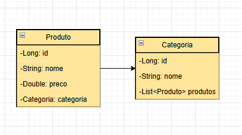
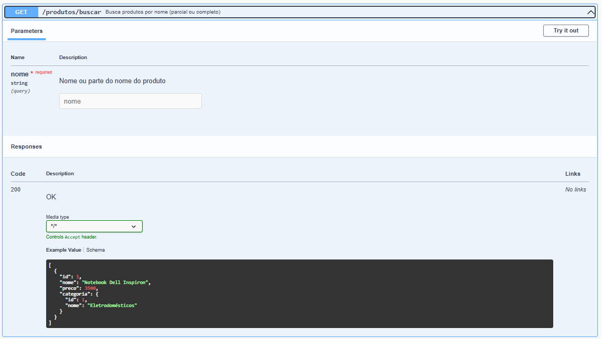
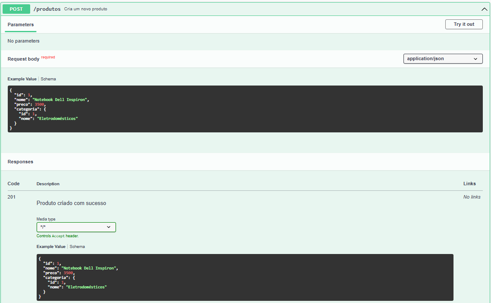
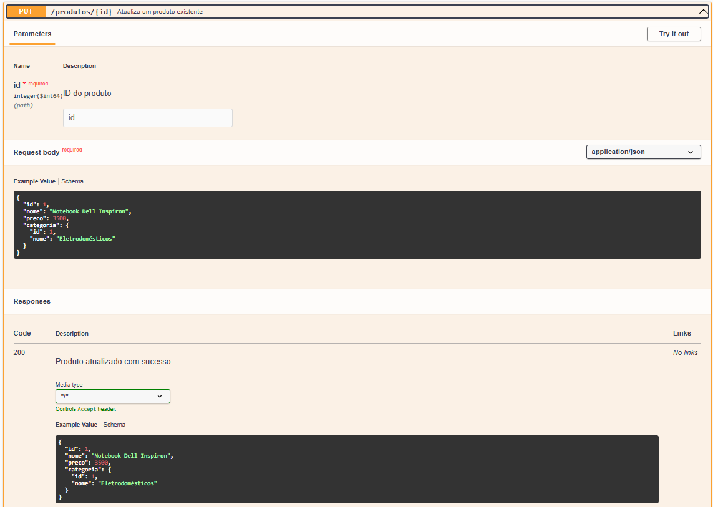
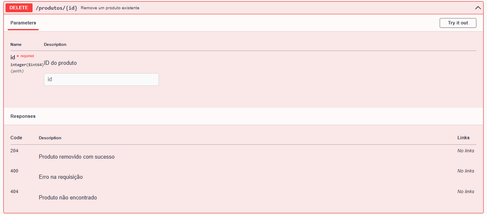
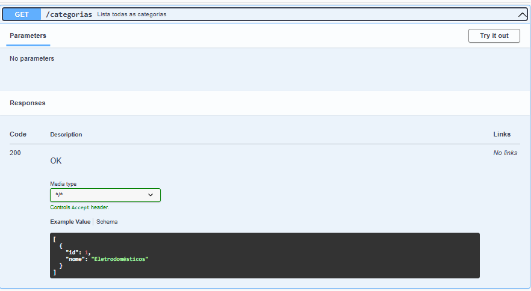
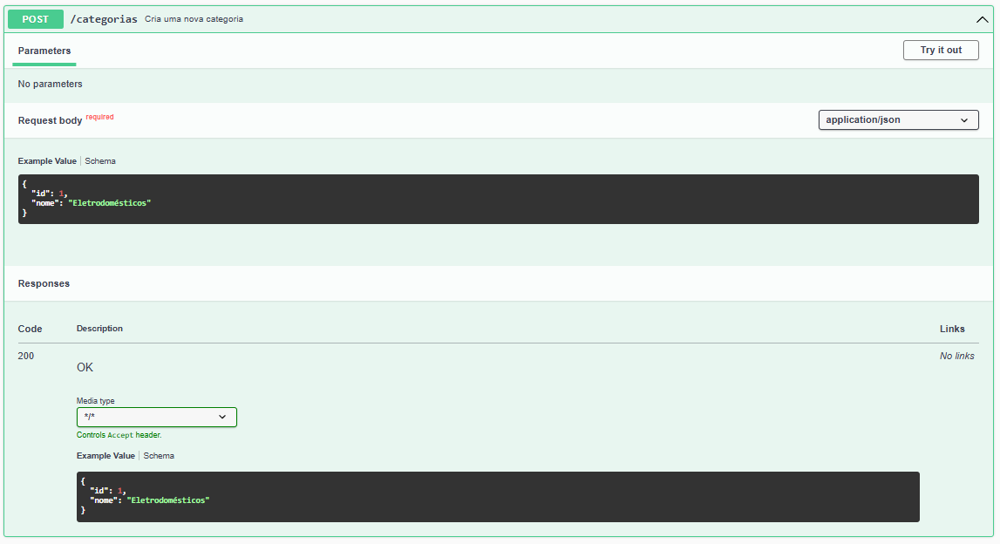

# API de Produtos

## Estrutura

## 📂 Estrutura do Projeto

O projeto segue o padrão MVC (Model-View-Controller), organizado em camadas:

- `model`: Contém as entidades do banco de dados (`Produto`, `Categoria`).
- `repository`: Interfaces de acesso ao banco (Spring Data JPA).
- `service`: Camada de negócio, onde são aplicadas as validações e regras.
- `controller`: Responsável pelas rotas da API e exposição dos dados.

Cada camada tem responsabilidades bem definidas:

- **Model**: Define a estrutura das tabelas e mapeia o relacionamento entre elas.
- **Repository**: Realiza operações de persistência e consultas com base em nomes de métodos ou anotações JPQL.
- **Service**: Aplica regras de negócio e centraliza a lógica de validação e processamento.
- **Controller**: Expõe os serviços REST, recebe requisições HTTP e retorna respostas adequadas.

## Diagrama de classes (resumido)

## Endpoints

- `GET /produtos/buscar`:

- `GET /produtos/{id}/desconto`:

- `POST /produtos`:

- `PUT /produtos/{id}`:

- `DELETE /produtos/{id}`:

- `GET /categorias`:

- `GET /categorias/{id}/produtos`:

- `POST /categorias`:

## Regras de negócio
- Nome do produto é obrigatório (entre 2 e 100 caracteres).
- Preço máximo permitido: R$10.000,00.
- Produto com "Promoção" no nome deve custar menos de R$500,00.
- Não é permitido cadastrar dois produtos com o mesmo nome (case-insensitive).
- Cálculo de desconto limitado a 50% do valor do produto.
- Produto deve estar vinculado a uma categoria existente

